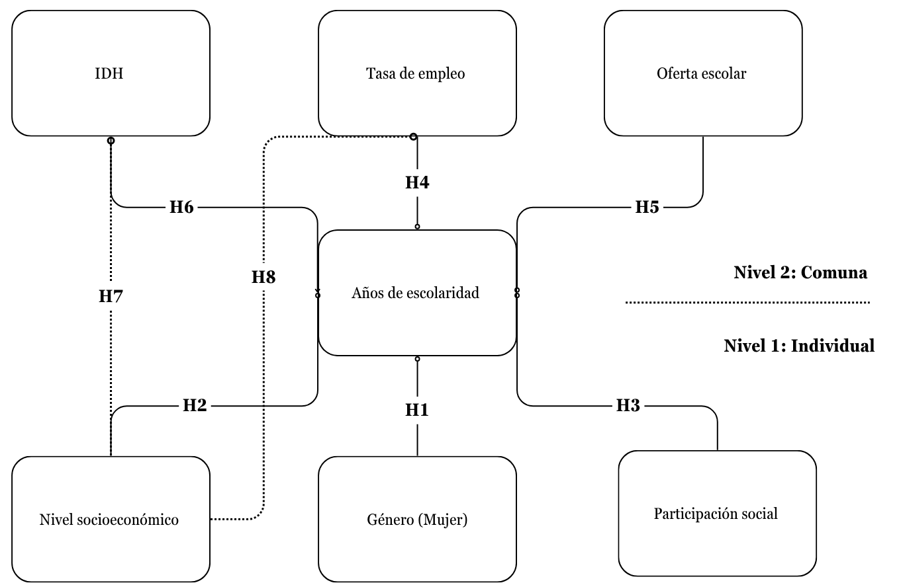
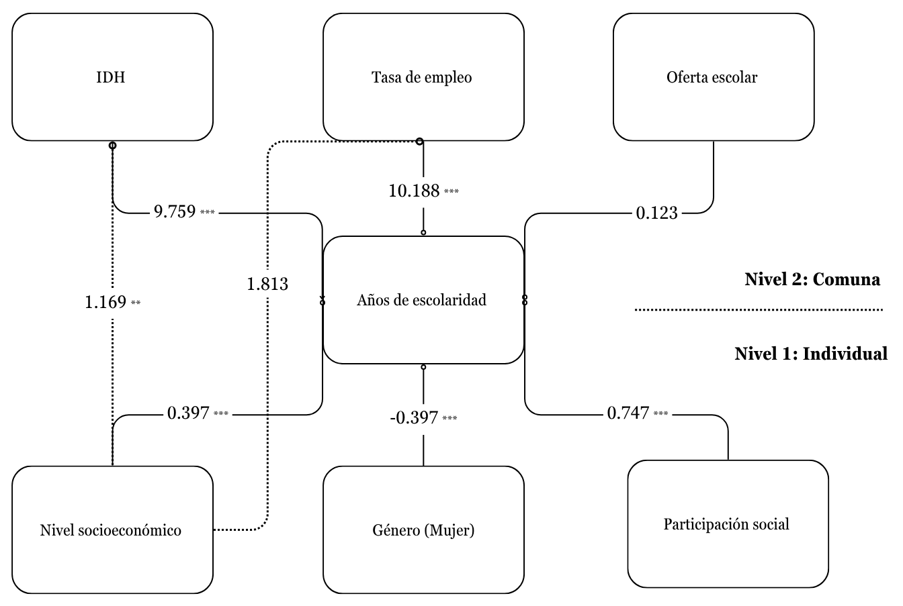

---
format:
  revealjs:
    title-slide: false
    theme: multinivel.scss
    incremental: true 
    slideNumber: true
    auto-stretch: false
    transition: fade
    transition-speed: slow
    scrollable: true
    scrollOverflow: true           
    css: estilos.css 
    self-contained: true
editor: source
---

# 

```{r paquetes y modelos}
#| include: false
#| message: false

if (!require("pacman")) install.packages("pacman") # solo la primera vez
pacman::p_load(lme4,
               kableExtra,
               haven,
               car,
               reghelper,
               sjmisc,
               sjPlot,
               stargazer,
               ggplot2,
               texreg,# gráficos
               dplyr,
               foreign,
               lattice,
               ggeffects,
               ggrepel,
               modelsummary,# manipulacion de datos
               equatiomatic, knitr, kableExtra, htmltools) # paquetes a cargar


casen_educ <- readRDS("output/casen_educ.rds")


```

:::::: columns
::: {.column width="20%"}
:::

:::: {.column .column-right width="80%"}
## **Entre el mérito y la estructura social: Desigualdad educativa en el Gran Santiago**

### **Un análisis multinivel de factores individuales y territoriales**

------------------------------------------------------------------------

**Katherine Aravena Herrera, Paula Cerda Torres & Sebastián Monreal Villarroel**

::: {.red2 .medium}
**Análisis de datos multinivel - 2025**

**Departamento de Sociología, Universidad de Chile**
:::

Santiago, 2025
::::

[Github repo](link%20al%20repo)
::::::

::: notes
Aquí mis notas
:::

# Introducción

**Problema / Objeto de estudio:**

**La desigualdad educativa** persiste como una de las principales barreras para la movilidad social en Chile, especialmente en la Región Metropolitana de Santiago [(Ministerio de Educación, 2023; OECD, 2021)]{.small-text}. Aunque el acceso a la educación básica y media se ha expandido, las diferencias en años de escolaridad siguen reproduciendo clivajes de clase, género y territorio [(Agencia de Calidad de la Educación, 2015; Bellei, Contreras & Valenzuela, 2008).]{.small-text}

A raiz de lo anterior, el objetivo del estudio es analizar cómo la **interacción** entre recursos familiares (nivel socioeconómico, participación social) y **condiciones comunales** (tasa de empleo, oferta educativa, IDH) explica las diferencias en años de escolaridad en el Gran Santiago mediante un enfoque multinivel [(Finch et al., 2019; Romero et al., 2020).]{.small-text}

------------------------------------------------------------------------

## Desde la sociología de la educación, esta persistencia se explica mediante:

1.  Reproducción de capitales familiares — la escuela convierte de forma desigual el capital económico, cultural y social de origen en logro académico, reforzando la ventaja heredada [(Bourdieu & Passeron, 2001; Bellei et al., 2008).]{.small-text}

2.  Lógica meritocrática — los criterios de evaluación escolar naturalizan esas ventajas, atribuyendo el éxito exclusivamente al mérito individual [(Ministerio de Educación, 2023; OECD, 2021).]{.small-text}

3.  Efectos de contexto — las oportunidades educativas están moduladas por la estructura territorial (segregación residencial, oferta escolar, dinamismo laboral), que amplifica o atenúa los recursos familiares [(Soler & Fernández, 2021; Canales & Ibarrola, 2022; Villalobos & Mardones, 2022).]{.small-text}

------------------------------------------------------------------------

-   **Factores asociados L1:** Nivel socioeconómico del hogar [(Arita et al., 2015; Bellei et al., 2008)]{.small-text}, Género [(OECD, 2021; Peláez & Rodríguez, 2020)]{.small-text}y Participación social familiar [(Bullones, 2022; Canales & Ibarrola, 2022).]{.small-text}

    > <span class="small-text"> Estos factores se entienden como recursos o desventajas que configuran las trayectorias escolares desde el origen social, afectando tanto el acceso como la permanencia y el logro educativo.

-   **Factores asociados L2:** Tasa de empleo comunal [(Villalobos & Mardones, 2022)]{.small-text}, IDH comunal [(Andréu, 2013; Giménez, 2004)]{.small-text} y oferta educativa comunal [(Rivas & Terra, 2024; Soler & Fernández, 2021).]{.small-text}

    > <span class="small-text"> Estas variables expresan las condiciones estructurales del territorio, influyendo en las oportunidades educativas disponibles. Se incorporan para analizar cómo el entorno puede amplificar o mitigar las desigualdades preexistentes, más allá de las características individuales.

##  {data-background-color="#FF0000"}

::: {.center .middle}
[¿En qué medida los distintos factores de socialización —tanto familiares como territoriales— influyen en los años de escolaridad de los habitantes del Gran Santiago?]{style="font-size: 230%;"}
:::

## Hipótesis: {.smaller}

***Nivel 1:***

<span class="small-text"> $H_1$: Las mujeres completan, en promedio, menos años de escolaridad que los hombres.

<span class="small-text"> $H_2$: Cuanto más alto es el nivel socioeconómico (NSE) del hogar, más años de escolaridad alcanza el estudiante.

<span class="small-text"> $H_3$: Provenir de un hogar con participación social aumenta los años de escolaridad frente a hogares carentes en redes comunitarias.

***Nivel 2:***

<span class="small-text"> $H_4$: Las comunas con mayor tasa de empleo presentan una escolaridad promedio más alta.

<span class="small-text"> $H_5$: Las comunas con mayor proporción de escuelas por 10.000 habitantes ofrecen más oportunidades y muestran mayores años de escolaridad.

<span class="small-text"> $H_6$: Las comunas que presentan un mayor IDH presentan una escolaridad promedio más alta.

***Interacción entre niveles:***

<span class="small-text"> $H_7$: El efecto positivo del nivel socioeconómico (NSE) sobre la escolaridad es más intenso en comunas con alta tasa de empleo; un mercado laboral dinámico potencia los recursos familiares.

<span class="small-text"> $H_8$: El efecto positivo del nivel socioeconómico (NSE) sobre la escolaridad es más intenso en comunas con un alto IDH

## Modelo teórico {.center}

{fig-align="center" width="773" height="494"}

# Metodología {data-background-color="#FF0000"}

## Datos

Se utilizó la base de datos de la **CASEN 2022**, que tiene un diseño muestral probabilístico, estratificado por región, comuna y área urbana/rural.

Para el análisis se trabajó con **22.706 individuos** (nivel 1) de 18 o más años, anidados dentro de las **32 comunas** del Gran Santiago (nivel 2), con un promedio de 702 casos por comuna.\

## Variables

```{r tabla_nivel1, echo=FALSE, results='asis'}
library(dplyr)
library(tidyr)
library(gt)

# ────────────────────────────────
# Función: tabla descriptiva gt
# ────────────────────────────────

desc_tab <- function(df, titulo, etiquetas){
  stats <- c("N","Min","P25","Med","Mean","P75","Max","SD")
  
  df |>
    summarise(across(
      everything(),
      list(
        N    = ~sum(!is.na(.)),
        Min  = ~min(., na.rm = TRUE),
        P25  = ~quantile(., .25, na.rm = TRUE),
        Med  = ~median(., na.rm = TRUE),
        Mean = ~mean(., na.rm = TRUE),
        P75  = ~quantile(., .75, na.rm = TRUE),
        Max  = ~max(., na.rm = TRUE),
        SD   = ~sd(., na.rm = TRUE)
      ),
      .names = "{.col}_{.fn}"
    )) |>
    pivot_longer(
      everything(),
      names_to      = c("Variable", ".stat"),
      names_pattern = "(.+)_(N|Min|P25|Med|Mean|P75|Max|SD)"
    ) |>
    pivot_wider(names_from = .stat, values_from = value) |>
    mutate(Variable = recode(Variable, !!!etiquetas)) |>
    
    gt(rowname_col = "Variable") |>
    fmt_number(columns = stats[stats != "N"], decimals = 2) |>
    fmt_number(columns = "N", decimals = 0) |>
    cols_label(
      N    = "N", Min = "Mín.", P25 = "P25",
      Med  = "Mediana", Mean = "Media",
      P75  = "P75", Max = "Máx.", SD = "SD"
    ) |>
    tab_header(title = md(paste0("**", titulo, "**"))) |>
    tab_options(
      table.font.size           = px(20),  # ← tamaño base
      column_labels.font.size   = px(22),  # ← encabezados
      column_labels.font.weight = "bold",
      heading.padding           = px(6),
      data_row.padding          = px(6)
    )
}

# ---- NIVEL 1 -----------------------------------------------------------
nivel1 <- casen_educ |>
  mutate(female = as.numeric(female),
         part_social_num = as.numeric(part_social_num)) |>
  select(esc, female, nse_numerico, part_social_num)

labels_lvl1 <- c(
  esc             = "Años de escolaridad",
  female          = "Mujer (1 = Sí)",
  nse_numerico    = "Nivel socioeconómico (NSE)",
  part_social_num = "Participación social (n.º)"
)

tab_lvl1 <- desc_tab(nivel1,
                     "Estadísticos descriptivos – Nivel 1 (individual)",
                     labels_lvl1)

# ---- NIVEL 2 -----------------------------------------------------------
nivel2 <- casen_educ |>
  select(comuna, prop_pob_esc, prop_empleo, idh_comuna) |>
  distinct() |>
  select(-comuna)

labels_lvl2 <- c(
  prop_pob_esc = "Escuelas por 10 000 hab.",
  prop_empleo  = "Tasa de empleo comunal",
  idh_comuna   = "IDH comunal"
)

tab_lvl2 <- desc_tab(nivel2,
                     "Estadísticos descriptivos – Nivel 2 (comunal)",
                     labels_lvl2)

# ---- Imprime una debajo de la otra -------------------------------------
tab_lvl1
tab_lvl2
```

## Métodos

Se utilizó una metodología de análisis estadístico multinivel. De este modo se puede observar de manera más precisa cómo **las trayectorias educativas** se configuran por la interacción entre **factores individuales** y **contextuales**.

El análisis de datos se realizó en Rstudio, utilizando lmer para la construcción de los modelos, sjPlot para la visualización de los datos y summary tools para generar descriptivos univariados

Se estimaron un total de 7 modelos, siguientes modelos:

## Modelos estimados

**Modelo 0: nulo**

$$
\text{esc}_{ij} \;=\; \gamma_{00}
+ u_{0\text{comuna}}
+ r_{ij}
$$

**Modelo 1: variables independientes individuales**

$$
\begin{aligned}
\text{esc}_{ij} &= \gamma_{00} \\
          &+ \gamma_{01}\,\text{female} \\
          &+ \gamma_{02}\,\text{nse_cmc} \\
          &+ \gamma_{03}\,\text{part_social_num} \\
          &+ u_{0\text{comuna}} + r_{ij}
\end{aligned}
$$

## Modelos

**Modelo 2: variables independientes contextuales**

$$
\begin{aligned}
\text{esc}_{ij} &= \gamma_{00} \\
          &+ \gamma_{01}\,\text{prop_empleo_gmc} \\
          &+ \gamma_{02}\,\text{prop_pob_escn_gmc} \\
          &+ \gamma_{03}\,\text{idh_gmc} \\
          &+ u_{0\text{comuna}} + r_{ij}
\end{aligned}
$$

**Modelo 3: variables independientes individuales y contextuales**

$$
\begin{aligned}
\text{esc}_{ij} &= \gamma_{00} \\
          &+ \gamma_{01}\,\text{female}
            + \gamma_{02}\,\text{nse_cmc}
            + \gamma_{03}\,\text{part_social_num} \\
          &+ \gamma_{04}\,\text{prop_empleo_gmc}
            + \gamma_{05}\,\text{prop_pob_esc_gmc}
            + \gamma_{06}\,\text{idh_gmc} \\
          &+ u_{0j} + r_{ij}
\end{aligned}
$$

## Modelos

**Modelo 4: intercepto y pendiente aleatoria de NSE**

$$
  \
  \begin{aligned}
  \text{esc}_{ij} =\;&
      \gamma_{00}
    + \gamma_{01}\,\text{female}
    + \gamma_{02}\,\text{nse_cmc}
    + \gamma_{03}\,\text{part_social_num} \\[4pt]
    &+ \gamma_{04}\,\text{prop_empleo_gmc}
    + \gamma_{05}\,\text{prop_pob_esc_gmc}
    + \gamma_{06}\,\text{idh_gmc} \\[4pt]
    &+ u_{0j}
    + u_{1j}\,\text{nse_cmc}
    + r_{ij}
  \end{aligned}
  \
$$

**Modelo 5: interacción entre NSE y empleo**

$$
  \
  \begin{aligned}
  \text{esc}_{ij} =\;&
  \gamma_{00}
+ \gamma_{01}\,\text{female}
+ \gamma_{02}\,\text{nse_cmc}
+ \gamma_{03}\,\text{part_social_num} \\[4pt]
&+ \gamma_{04}\,\text{prop_empleo_gmc}
+ \gamma_{05}\,\text{prop_pob_esc_gmc}
+ \gamma_{06}\,\text{idh_gmc} \\[4pt]
&+ \gamma_{07}\bigl(\text{nse_cmc}\,\times\,\text{prop_empleo_gmc}\bigr) \\[4pt]
&+ u_{0j}
+ u_{1j}\,\text{nse_cmc}
+ r_{ij}
  \end{aligned}
  \
$$

## Modelos

**Modelo 6: interacción entre NSE y IDH**

$$
 \
  \begin{aligned}
  \text{esc}_{ij} =\;&
  \gamma_{00}
+ \gamma_{01}\,\text{female}
+ \gamma_{02}\,\text{nse_cmc}
+ \gamma_{03}\,\text{part_social_num} \\[4pt]
&+ \gamma_{04}\,\text{prop_empleo_gmc}
+ \gamma_{05}\,\text{prop_pob_esc_gmc}
+ \gamma_{06}\,\text{idh_gmc} \\[4pt]
&+ \gamma_{07}\bigl(\text{nse_cmc}\,\times\,\text{idh_gmc}\bigr) \\[4pt]
&+ u_{0j}
+ u_{1j}\,\text{nse_cmc}
+ r_{ij}
  \end{aligned}
  \
$$

# Resultados {data-background-color="#FF0000"}

# Descriptivos {data-background-color="#FF0000"}

## Scatterplot:

Relación entre promedio comunal de escolaridad y tasa de empleo

```{r Scatterplot}
casen_educ %>% 
  group_by(comuna) %>% 
  summarise(
    esc_prom    = mean(esc, na.rm = TRUE),
    prop_empleo = first(prop_empleo)
  ) %>% 
  ggplot(aes(x = prop_empleo, y = esc_prom)) +
  geom_point() +
  geom_text_repel(aes(label = comuna), size = 3) +   # tamaño reducido
  geom_smooth(method = "lm", se = FALSE, color = "steelblue") +
  labs(
    title = "Relación entre tasa de empleo comunal y escolaridad promedio",
    x     = "Tasa de empleo (proporción)",
    y     = "Años promedio de escolaridad"
  ) +
  theme_minimal()


```

------------------------------------------------------------------------

## Scatterplot:

Relación entre promedio comunal de escolaridad y IDH

```{r Boxplot}
casen_educ %>% 
  group_by(comuna) %>% 
  summarise(
    esc_prom    = mean(esc, na.rm = TRUE),
    idh_comuna = first(idh_comuna)
  ) %>% 
  ggplot(aes(x = idh_comuna, y = esc_prom)) +
  geom_point() +
  geom_text_repel(aes(label = comuna), size = 3) +   # tamaño reducido
  geom_smooth(method = "lm", se = FALSE, color = "steelblue") +
  labs(
    title = "Relación entre IDH y escolaridad promedio",
    x     = "Indice de Desarollo Humano ",
    y     = "Años promedio de escolaridad"
  ) +
  theme_minimal()
```

## Modelos

```{r definir modelos y centrado, include=FALSE}
# CENTRADO DE VARIABLES --------------------------------------------------------
# ─────────────────  CMC para NSE individual  ─────────────────
casen_educ <- casen_educ %>% 
  group_by(comuna) %>% 
  mutate(
    mean_nse_comuna = mean(nse_numerico, na.rm = TRUE),
    nse_cmc         = nse_numerico - mean_nse_comuna
  ) %>% 
  ungroup()
# ─────────────────  GMC para variables comunales  ─────────────────
casen_educ <- casen_educ %>% 
  mutate(
    prop_empleo_gmc = prop_empleo - mean(prop_empleo, na.rm = TRUE),
    prop_pob_esc_gmc  = prop_pob_esc  - mean(prop_pob_esc,  na.rm = TRUE),
    idh_gmc  = idh_comuna  - mean(idh_comuna,  na.rm = TRUE),
  )

# Definir los modelos sin mostrar nada

# Modelo 0: nulo / ICC ---------------------------------------------------------
m0 <- lmer(esc ~ 1 + (1 | comuna), data = casen_educ)
ICC(m0)

# Modelo 1: solo predictores nivel 1 ------------------------------------------
m1 <- lmer(
  esc ~ 1 + female + nse_cmc + part_social_num +
    (1 | comuna),
  data = casen_educ
)

# Modelo 2: solo predictores nivel 2 ------------------------------------------
m2 <- lmer(
  esc ~ 1 + prop_empleo_gmc + prop_pob_esc_gmc + idh_gmc +
    (1 | comuna),
  data = casen_educ
)

# Modelo 3: fijos L1 + L2 ------------------------------------------------------
m3 <- lmer(
  esc ~ 1 + female + nse_cmc + part_social_num +
    prop_empleo_gmc + prop_pob_esc_gmc + idh_gmc +
    (1 | comuna),
  data = casen_educ
)


# Modelo 4: pendiente aleatoria para NSE (ya estimado) -------------------------
m4 <- lmer(
  esc ~ 1 + female + nse_cmc + part_social_num +
    prop_empleo_gmc + prop_pob_esc_gmc + idh_gmc +         # efectos fijos
    (1 + nse_cmc | comuna),                     # intercepto + pendiente NSE
  data = casen_educ
)  # test de devianza (m3 = fijos L1+L2)

# Modelo 5-H6: interacción L1 × L2 SOLO para H6 -------------------------------
m5_H6 <- lmer(
  esc ~ 1 +
    nse_cmc         * prop_empleo_gmc +    # H6 (se mantiene)
    part_social_num + idh_gmc +                     # efecto principal (sin interacción)
    prop_pob_esc_gmc +                      # efecto principal contextual
    female +
    (1 + nse_cmc | comuna),
  data = casen_educ
)
# Modelo 6-H7: interacción L1 × L2 SOLO para H7 -------------------------------

m6_H7 <- lmer(
  esc ~ 1 +
    nse_cmc         * idh_gmc +           # ← NUEVA interacción H7
    part_social_num +                     # efecto principal (sin interacción)
    prop_empleo_gmc +                     # efecto contextual
    prop_pob_esc_gmc +                      # efecto contextual
    female +
    (1 + nse_cmc | comuna),               # pendiente aleatoria para NSE
  data = casen_educ,
  control = lmerControl(
    optimizer = "bobyqa",
    optCtrl   = list(maxfun = 1e5)        # para estabilidad si fuera necesario
  )
)
```

```{r tabla_modelos, echo=FALSE, results='asis'}
library(sjPlot)

# 1. Genera la tabla SIN imprimirla
html_tab <- tab_model(
 m0, m1, m2, m3, m4, m5_H6, m6_H7,
  show.ci  = FALSE,
  show.se  = TRUE,
  p.style  = "stars",
  digits   = 3,
  dv.labels = c(
    "Nulo (ICC)", "L1 (centrado)", "L2 (centrado)",
    "L1 + L2", "+ Pend. NSE", "+ Interacción H7", "+ Interacción H8"
  ),
  file = NA          # ← devuelve la lista, no la imprime
)

# 2. Compone la salida (solo UNA vez)
salida <- paste0(
  "<style>", html_tab$page.style, "</style>",
  '<div class="hscroll small-table">', html_tab$page.content, "</div>"
)

knitr::asis_output(salida)
invisible(NULL)      # evita ecos adicionales
```

------------------------------------------------------------------------

## Test de devianza

```{r test de devianza}
#| label: lrt-table
#| echo: false
#| results: asis
#| warning: false
#| message: false


## 1 ─ LRT ----------------------------------------------------------------------
lrt_raw <- anova(m3, m4) |>
  as.data.frame() |>
  tibble::rownames_to_column("modelo") |>
  mutate(modelo = recode(modelo,
                         m3 = "sin&nbsp;pendiente",
                         m4 = "con&nbsp;pendiente"))

row_lrt <- tibble(
  modelo = "LRT", npar = NA, AIC = NA, BIC = NA, logLik = NA,
  LRT = lrt_raw$Chisq[2], gl = lrt_raw$Df[2],
  p = lrt_raw$`Pr(>Chisq)`[2]
)

tabla_lrt <- bind_rows(
  select(lrt_raw, modelo, npar, AIC, BIC, logLik),
  row_lrt
)

## 2 ─ kable en HTML ------------------------------------------------------------
tbl_html <- kable(tabla_lrt, "html", digits = 3, escape = FALSE,
                  caption = "¿La pendiente aleatoria de NSE mejora el ajuste?") |>
  kable_styling(full_width = FALSE,
                bootstrap_options = c("striped", "hover", "condensed"),
                font_size = 15) |>          # ← TAMAÑO FUENTE (sube o baja)
  add_header_above(c(" " = 5, "Likelihood-ratio test" = 3)) |>
  add_footnote(
    "χ² significativo (p < 0.001) ⇒ conviene dejar la pendiente de NSE como aleatoria",
    notation = "none"
  )

## 3 ─ contenedor centrado con scroll si hace falta ----------------------------
scroll_box <- div(
  style = "
    max-width: 1000px;      /* cambia este ancho si lo necesitas */
    margin: 0 auto;         /* centra la tabla */
    overflow-x: auto;       /* barra horizontal si se pasa de 1000 px */
  ",
  HTML(tbl_html)
)

knitr::asis_output(as.character(scroll_box))
```

------------------------------------------------------------------------

## Interacción H7

::::: columns
::: {.column width="60%"}
```{r fig-h7, echo=FALSE, message=FALSE, warning=FALSE}
library(sjPlot)
library(ggplot2)

# 1. Pedimos explícitamente el gráfico
plot_obj <- plot_model(
  m5_H6,
  type  = "int",
  terms = c("nse_cmc", "prop_empleo_gmc"),
  plot  = TRUE         # ← asegura un ggplot
)

# 2. Si devuelve un data.frame (clas. 'ggeffects'), lo convertimos
if (inherits(plot_obj, "data.frame")) {
  plot_obj <- plot(plot_obj)        # convierte al ggplot por método S3
}

# 3. Personalizamos
plot_obj <- plot_obj +
  labs(
    title  = "Interacción H7: NSE × Empleo comunal",
    x      = "NSE centrado en la comuna (CMC)",
    y      = "Años esperados de escolaridad",
    colour = "Empleo comunal\n(GMC; −1 DE / Media / +1 DE)"
  ) +
  theme_minimal(base_size = 12)

# 4. Imprimimos → Quarto lo renderiza
print(plot_obj)

```
:::

::: {.column width="40%"}
[La interacción muestra que el efecto del nivel socioeconómico sobre la escolaridad varía según la tasa de empleo comunal. En comunas con más empleo (azul), el NSE tiene un impacto mayor sobre los años de escolaridad, mientras que en comunas con menos empleo (roja), su efecto es más débil. Esto confirma que los recursos familiares rinden más en contextos laborales favorables, ampliando así las desigualdades educativas.]{style="font-size: 80%;"}
:::
:::::

------------------------------------------------------------------------

## Interacción H8

::::: columns
::: {.column width="60%"}
```{r fig-h8, echo=FALSE, message=FALSE, warning=FALSE, fig.width=6, fig.height=4}
library(sjPlot)
library(ggplot2)

# 1. Solicita el gráfico; plot=TRUE debería devolver un ggplot.
plot_obj <- plot_model(
  m6_H7,
  type  = "int",
  terms = c("nse_cmc", "idh_gmc"),
  plot  = TRUE
)

# 2. Si (por versión/bug) viene como data.frame "ggeffects", lo convertimos:
if (inherits(plot_obj, "data.frame")) {
  plot_obj <- plot(plot_obj)   # método de ggeffects → devuelve ggplot
}

# 3. Personaliza títulos y tema
plot_obj <- plot_obj +
  labs(
    title  = "Interacción H8: NSE individual × IDH comunal",
    x      = "NSE centrado en la comuna (CMC)",
    y      = "Años esperados de escolaridad",
    colour = "IDH comunal\n(GMC; −1 DE / Media / +1 DE)"
  ) +
  theme_minimal(base_size = 12)

# 4. Imprime el ggplot (Quarto lo incrusta)
print(plot_obj) 
```
:::

::: {.column width="40%"}
[La interacción muestra que el efecto del NSE sobre la escolaridad varía según el IDH comunal. En comunas con un mayor IDH (azul), el NSE tiene un impacto mayor sobre los años de escolaridad, mientras que en comunas con un menor IDH (roja), su efecto es más débil. Suguiriendo que que el capital económico tiene un mayor impacto educativo en contextos comunales más desarrollados, donde pueden existen más recursos institucionales para transformar las ventajas familiares en logros escolares.]{style="font-size: 70%;"}
:::
:::::

# **Observaciones influyentes**

```{r Observaciones influyentes}
#| include: false
library(influence.ME)  # Cook's distance por grupo
library(dplyr)         # manipulación de datos
library(forcats)       # fct_drop
library(sjPlot)        # tab_model
library(broom.mixed)   # tidy() para lmer
# ---------------------------------------------------------------
# 0. Cargar paquetes y base de datos ----------------------------
# ---------------------------------------------------------------
library(lme4)          # modelos multinivel
library(influence.ME)  # Cook's distance por grupo
library(dplyr)         # manipulación de datos
library(forcats)       # fct_drop
library(sjPlot)        # tab_model
library(broom.mixed)   # tidy() para lmer

casen_educ_cen <- readRDS("output/casen_educ_cen.rds") %>%
  filter(!is.na(comuna)) %>%                # asegura no haber NAs
  mutate(comuna = as.factor(comuna))        # comuna como factor

stopifnot(nlevels(casen_educ_cen$comuna) == 32)  # debe haber 32 comunas

# ────────────────────────────────────────────────────────────────────────
# 1. Modelo original (m4) ‒ con nuevas variables contextuales
# ────────────────────────────────────────────────────────────────────────
m4 <- lmer(
  esc ~ female + nse_cmc + part_social_num +
    prop_empleo_gmc + prop_pob_esc_gmc + idh_gmc +
    (1 + nse_cmc | comuna),
  data = casen_educ_cen
)

# ────────────────────────────────────────────────────────────────────────
# 2. Cook’s Distance por comuna
# ────────────────────────────────────────────────────────────────────────
infl_m4   <- influence(m4, group = "comuna")
cook_vals <- cooks.distance(infl_m4, sort = FALSE)

# añade nombres si faltan
if (is.null(names(cook_vals)) || length(names(cook_vals)) == 0) {
  names(cook_vals) <- levels(casen_educ_cen$comuna)
}

k      <- nlevels(casen_educ_cen$comuna)   # 32
cutoff <- 4 / k                            # ≈ 0.125
influentes <- names(cook_vals)[!is.na(cook_vals) & cook_vals > cutoff]

cat("Comunas influyentes (Cook >", round(cutoff, 3), "):\n")
print(influentes)
```

```{r Gráfico de Cook}
# ---------------------------------------------------------------
# 3. Gráfico de Cook --------------------------------------------
# ---------------------------------------------------------------
plot(
  infl_m4, which = "cook",
  cutoff  = cutoff, sort = TRUE,
  xlab    = "Cook's distance", ylab = "Comuna",
  main    = "Distancia de Cook – Influencia por comuna (modelo m4)"
)

```

------------------------------------------------------------------------

```{r}
#| include: false
# ---------------------------------------------------------------
# 4. Modelo recortado (m4_trim) ---------------------------------
# ---------------------------------------------------------------
# ────────────────────────────────────────────────────────────────────────
# 4. Modelo recortado (m4_trim) sin comunas influyentes
# ────────────────────────────────────────────────────────────────────────
casen_trim <- casen_educ_cen %>%
  filter(!comuna %in% influentes) %>% 
  mutate(comuna = fct_drop(comuna))

m4_trim <- lmer(
  esc ~ female + nse_cmc + part_social_num +
    prop_empleo_gmc + prop_pob_esc_gmc + idh_gmc +
    (1 + nse_cmc | comuna),
  data  = casen_trim,
  REML  = FALSE
)

cat("\nNúmero de comunas en m4_trim:\n")
print(summary(m4_trim)$ngrps)

```

```{r}
tab_model(
  m4, m4_trim,
  dv.labels = c("Modelo original", "Sin comunas influyentes"),
  show.ci   = FALSE, p.style = "stars", digits = 3
)

```

# **Discusión**

{fig-align="center" width="773" height="494"}

# Conclusiones {data-background-color="#FF0000"}

-   **Aporte metodológico**: El modelo multinivel distinguió con precisión la varianza entre y dentro de comunas, revelando interacciones ocultas.

-   **Limitaciones:** Falta información sobre calidad escolar y el diseño transversal no permite causalidad.

-   **Próximos pasos:** Extender el análisis a otras regiones y sumar datos longitudinales y de calidad educativa.

-   **Política pública:** Combinar desarrollo territorial con apoyo al capital familiar para reducir brechas escolares.

## Referencias

Agencia de Calidad de la Educación. (2015, agosto). Evolución de las brechas socioeconómicas de rendimiento en pruebas SIMCE. División de Estudios, Agencia de Calidad de la Educación.

Andréu, J. (2011). El análisis multinivel: una revisión actualizada en el ámbito sociológico. Metodología de Encuestas, 13, 161–176.

Arita, M., Romano, A., García, A., & Félix, F. (2015). Condiciones de vida y bienestar subjetivo en Culiacán, México. Universidad Autónoma de Sinaloa.

Bellei Carvacho, C., Contreras, D., & Valenzuela Barros, J. P. (2008). La agenda pendiente en educación. Profesores, administradores y recursos: propuestas para la nueva arquitectura de la educación chilena. Universidad de Chile.

Bourdieu, P., & Passeron, J. C. (2001). La reproducción. Elementos para una teoría del sistema de enseñanza. Editorial Laia.

Bullones, E. (2022). Gestión educativa en valores para la paz comunitaria. Aula Virtual, 3(6), 150–160.

Canales, A., & de Ibarrola, M. (2022). La segmentación del sistema escolar mexicano: un análisis territorial. Revista Mexicana de Investigación Educativa, 27(94), 1035–1060.

Cimadamore, A. D., & Cattani, A. D. (Coords.). (2008). Producción de pobreza y desigualdad en América Latina. Siglo del Hombre Editores.

Finch, W. H., Bolin, J. E., & Kelley, K. (2019). Multilevel modeling using R. Chapman and Hall/CRC.

Instituto Nacional de Evaluación Educativa. (2011). PIRLS–TIMSS 2011. Estudio Internacional de Progreso en Comprensión Lectora, Matemáticas y Ciencias. Volumen I: Informe español. IEA.<https://www.mecd.gob.es/inee>

Ministerio de Educación de Chile. (2023). Informe de resultados SIMCE y brechas por grupo socioeconómico. Santiago: MINEDUC.

Ministerio de Desarrollo Social y Familia. (2022). Encuesta de Caracterización Socioeconómica Nacional (Casen) 2022. Gobierno de Chile.

OECD. (2021). Education at a Glance: OECD Indicators. OECD Publishing.<https://doi.org/10.1787/b35a14e5-en>

Peláez González, C., & Rodríguez, S. A. (2020). Género, trabajo y educación: Diferencias entre hombres y mujeres en la entrada al primer empleo. Revista Interdisciplinaria de Estudios de Género de El Colegio de México, 6, e494.

Rivas Espinosa, A., & Terra Polanco, V. (2024). Percepciones de niñas y niños sobre su hábitat en contextos urbanos informales. Sociológica (Madrid), 39(1).

Romero, E., Alcaraz, S., & Hernández, M. (2020). Desigualdades educativas y respuesta institucional: Una investigación desde la perspectiva territorial. Profesorado, Revista de Currículum y Formación del Profesorado, 24(1), 1–20.

Soler Mata, J., & Fernández León, R. (2021). La evaluación educativa en España: Tensiones entre la evaluación estandarizada y la evaluación formativa. Revista de Educación, 393, 245–271.

Villalobos, C., & Mardones, S. P. (2022). ¿Quién, cómo y de qué se investiga en un sistema educativo mercantilizado? Un meta-análisis de la investigación sobre política educativa en el Chile post-dictadura (1990–2019). Education Policy Analysis Archives, 30, 160.
